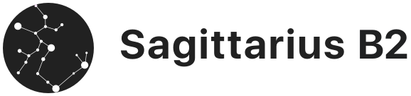

# Sagittarius B2

Ideja Sagitariusa je da učinimo računare i programiranje dostupnijim i pomognemo u edukaciji dece i ostalih zainteresovanih. Puno kolega se iz hobija bavi interesantnim projektima koji mogu biti zanimljivi široj zajednici. Učinimo još jedan korak da projekte uobličimo, dokumentujemo i predstavimo na jednom mestu. Verujem da u procesu deljenja znanja i ideja svi učesnici mogu da se zabave i nešto nauče.

Počećemo sa projektima za [Raspberry Pi](https://www.raspberrypi.org/) platformu, koje možete naći na [https://github.com/sagittarius-b2/raspberry-pi-projects](https://github.com/sagittarius-b2/raspberry-pi-projects).

Blog post kojim je sve počelo: [Raspberry Pi kao prvi računar?](https://bug.rs/2019/01/raspberry-pi-kao-prvi-racunar/)
